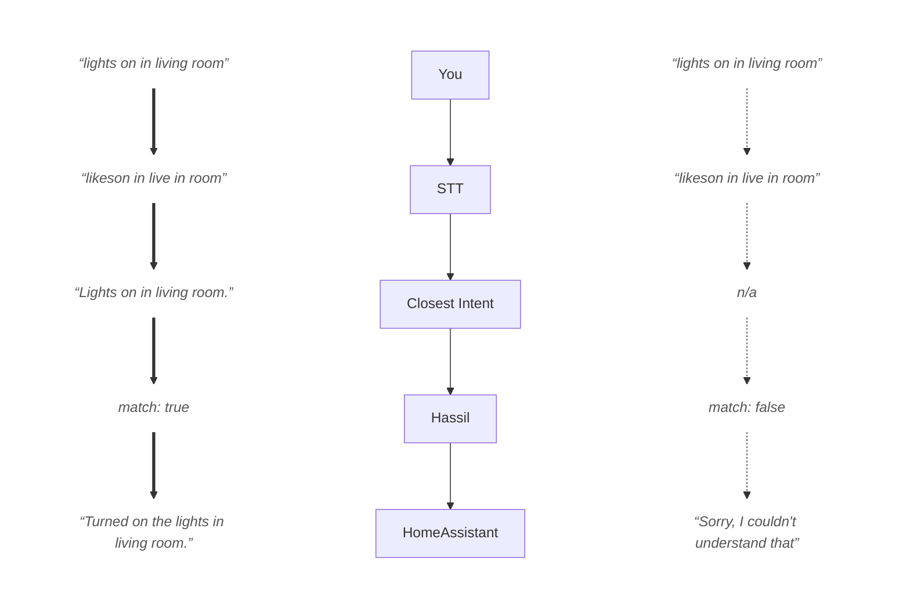

<div align="center">
  
  <h1>hass-closest-intent</h1>
</div>

<p align="center">
	Fuzzy intent matcher for HomeAssistant.<br/>Garbled STT output in, actual intent out.
</p>

<p align="center">
	<a href="https://github.com/charludo/hass-closest-intent/stargazers">
		</a>
	<a href="https://github.com/charludo/hass-closest-intent/issues">
		</a>
	<a href="https://github.com/charludo/hass-closest-intent">
		</a>
</p>

&#160;

### 🌲 Problem statement and solution

Speech-To-Text (STT) output, especially fast and local STT output, is often simply *bad*.
HomeAssistant's own [Hassil](https://github.com/OHF-Voice/hassil) is *incredibly* picky:
your STT output must match *exactly* to one of the configured intents.

There's two paths forward from this: Upgrade your hardware to support better STT, or
try to figure out what the speaker *probably meant* to say from the garbled output.

This project does the latter.

With this custom integration, "Lights on in **live in room**" will actually turn on the lights in your **living room**.
So will, for that matter, "lighrts on inn livainriomm".

Short demo, first with `closest-intent`, then with bare Hassil:


&#160;

### 📜 Highlights

- Pattern expansion. Expanding `<expansion_rules>`, `(alternatives|to)`, and `[optional|alternatives]` all work, including on HASS-defined lists like your home's areas and entities!
- Slot extraction. Both for wildcard slots (like for adding something to the shopping list, where the `{item}` is a wildcard), and against slots like `{timer_hours:hours}` with a fixed set of possibilities.
- Fuzzy slot resolution. For list-like slots and expansion rules (including your areas and entities!), fuzzy match the slot values to the available options. Allows "livikroom" to be corrected to "living room".
- Actual intent handling still done by Hassil. `closest-intent` simply corrects your STT output or typos to the closest matching intent, and then forwards a nice, canonical sentence to Hassil, who then deals with the intent just like if you had spoken/typed perfectly.
- 100% LLM-free. Just uses relatively simple fuzzy matching of the input against your intents, plus some clever-ish (well... working, at least) tricks to improve the results.
- Fallback agent support. OK, I said 100% LLM-free, but if you absolutely want to, you can use one as fallback. More on this below.
- Is fast :) (as in: basically instant for a couple hundred configured custom intents).

> **Note:** `closest-intent` is completely language-agnostic. All the examples in this `README` are in English, but you can use it with any language you like; personally, I use it in German.

&#160;

### 📋 Examples

Here's some examples of things I said, what my STT (`wyoming-faster-whisper-base`) understood, what HomeAssistant was able to do/answer after passing the STT output through `closest-intent`, and what the same STT output would have resulted in with just bare Hassil.

> **Note:** These are actual results I got when speaking the "what was said" sentences in my phone.
> I'm a native German speaker, and so I do have an accent, but this pretty closely matches my experience when using the German-language version of whisper.
> The "bare Hassil" responses are what I got after 1:1 pasting the STT output into the voice assist chat window with `closest-intent` disabled.

| what was said | STT output | with Closest Intent | bare Hassil |
| --- | --- | --- | --- |
| `start cleaning` | `Star cleaning.` | ✅ Cleaning started. | ❌ Sorry, I couldn't understand that |
| `stop cleaning` | `Stop clenching!` | ✅ Cleaning stopped. | ❌ Sorry, I am not aware of any device called clenching |
| `vacuum the living room` | `Vacuum Believing Room` | ✅ Cleaning the living room. | ❌ Sorry, I am unaware of any floor called Believing Room |
| `clean the office` | `King the Office` | ✅ Cleaning the office. | ❌ Sorry, there are multiple devices called Office *(author's note: no there aren't, wtf?)* |
| `vacuum the kitchen` | `Back here in the kitchen.` | ✅ Cleaning the kitchen. | ❌ Sorry, I couldn't understand that |
| `how warm is it in the bedroom` | `Our all is in the best room.` | ✅ In the bedroom, the temperature is currently.... | ❌ Sorry, I am not aware of any area called best room |
| `add milk to the shopping list` | `Add milk to the chauvinist.` | ✅ "milk" added. | ❌ Sorry, I am not aware of any device called chauvinist |
| `put call dentist on my todo list` | `put call dentist on my tudu list` | ✅ "call dentist" added. | ❌ Sorry, I am not aware of any device called tudu |
| `turn on the water pump` | `turn on the what her pump` | ✅ Turned on the water pump. | ❌ Sorry, I am not aware of any device called what her pump |
| `play some music` | `Place on music` | ✅ Playing music. | ❌ Sorry, I am not aware of any area called music |
| `resume the music` | `Renew Music` | ✅ Resuming. | ❌ Sorry, I couldn't understand that |
| `pause the music` | `Post music` | ✅ Paused. | ❌ Sorry, I couldn't understand that |
| `next track` | `next rack` | ✅ Next track. | ❌ Sorry, I am not aware of any device called rack |
| `enable shuffle` | `an able shuffling` | ✅ Shuffle enabled. | ❌ Sorry, I couldn't understand that |
| `disable shuffle` | `Disable to schaffen.` | ✅ Shuffle disabled. | ❌ Sorry, I am not aware of any device called Disable |
| `restart the player` | `Reset the plan.` | ✅ Restarting the player. | ❌ Sorry, I am not aware of any area called Reset |
| `play a random album` | `Player random album` | ✅ Playing a random album. | ❌ Sorry, I couldn't understand that |
| `play a random artist` | `Player and Immartist.` | ✅ Playing a random artist. | ❌ Sorry, I couldn't understand that |
| `play the latest tracks` | `Plan the ladder tracks.` | ✅ Playing recently added tracks. | ❌ Sorry, I am not aware of any area called Plan |
| `play recently played songs` | `Player recently played so...` | ✅ Playing recently heard tracks. | ❌ Sorry, I couldn't understand that |
| `play playlist NieR` | `Play playlist NEAR!` | ✅ Playing the playlist NieR. | ❌ Sorry, I couldn't understand that |
| `play my daily briefing` | `and play my daily breathing` | ✅ Here is your daily briefing: ... | ❌ Sorry, I am not aware of any area called and play |
| `what time is it` | `What the hell is it?` | ✅ It is 16:36. | ✅ It is 16:36. *(author's note: okay, know what? earned. did not expect that.)* |
| `what day is it today` | `One day is today.` | ✅ Today is Friday. | ✅/❌ May 8th, 2026 *(author's note: that's the output for "What **date** is it?", but, eh, close enough)* |
| `make the tv brighter` | `Make that CV brighter.` | ✅ Screen is now bright. | ❌ Sorry, I couldn't understand that |
| `set the screen darker` | `The screen doctor.` | ✅ Screen is now dark. | ❌ Sorry, I am not aware of any device called screen doctor |
| `what's the weather today` | `What's the matter with you?` | ✅ Today, the weather is... | ❌ It is 16:36. *(author's note: wait, WHAT?)* |
| `how's the weather tomorrow morning` | `How's the better tomorrow?` | ✅ Tomorrow morning, it will be... | ❌ Sorry, I am not aware of any area called How's |
| `what's the weather this week` | `What's the matter this weak` | ✅ Monday:..., Tuesday:..., | ❌ It is 16:36. *(author's note: sigh...)* |
| `how's the weather at 5 o'clock` | `cast the red there at 5 o'clock` | ✅ At 5 o'clock, it will be... | ❌ Sorry, I am not aware of any area called cast |
| `how windy is it right now` | `how windy is IR low` | ✅ The wind is currently blowing with... | ❌ No timers. |
| `how windy will it be tonight` | `How will you be tonight?` | ✅ Tonight, the wind speed will be around... | ❌ Sorry, I couldn't understand that |
| `how hot will it get today` | `How hard will it get today?` | ✅ Today, temperatures will reach up to... | ❌ Sorry, I couldn't understand that |
| `will it rain today` | `with it right today` | ✅ No rain is expected today. | ❌ Sorry, I couldn't understand that |

...you get the idea.

&#160;

### 💡 How it works

`closest-intent` is registered in HomeAssistant as a conversation agent.
On startup, it pulls the already-loaded vocabulary (intents, expansion rules, slot lists) straight from HomeAssistant's default conversation agent.
This includes the dynamically built `name`/`area`/`floor` lists derived from your exposed entities, areas, and floors.

By default, only user-defined intents enter the candidate pool.
Built-in intents are kept aside and can either be included wholesale (`include_builtins`) or by name (`builtin_allowlist`).

When a user request comes in (via voice command or the chat box), `closest-intent` fuzzy-matches that request against those expanded rules.
If the rule does not contain a slot, it is picked immediately.
If it does contain a slot, `closest-intent` performs a sequence of fancy magic steps to find the best-fitting slot value among a range of possible positions within the top-scoring matched sentences.
In practice, this often means "smallest slot-value on a word-boundary", but the extraction is not limited to that.

With the best match found, we then reconstruct the "canonical form", i.e. a sentence that Hassil will actually understand.
If in your configured intents, "Play some music." exists, and `closest-intent` got "Place on music" and matched that to the intent,
it will simply forward "Play some music." to Hassil. If the intent contained a slot, the extracted value will be substituted.

This guarantees that the sentence passed to Hassil will actually be understood, and allows us to not have to worry at all about performing actions, running scripts,...

If *no* matching intent could be found, we pass the exact input we got to the configured fallback agent.
By default, that is simply Hassil (which again allows us to be lazy and not worry about proper error responses), or another agent, like a LLM.

The "happy path" compared between with and without `closest-intent` thus looks something like this:



&#160;

### ⚠️ Limitations

There's two major limitations to consider.

1. False-positives are a real possibility.
   This is actually an error class that Hassil usually almost completely eliminates:
   since the input needs to match so perfectly to the configured intents,
   there's almost no way to trigger an intent unintentionally.
   **This issue gets worse the more similar-looking intents you have configured.**
   If you are experiencing issues with this, raise the configured `threshold` (see below).
1. Not entirely unrelated: by default, the builtin intents are disabled for matching in `closest-intent`. HomeAssistant configures a good amount of intents by default, and does so with a shitton of expansion rules to cover more possible commands.
   Expanding all those intents in full is simply not viable (see also: "combinatorial explosion"), so the same `expansion_cap` applies to them too.
   In general though, these expansions are not super useful either, since they often cover things like `(How is|How's)`, which just do not matter much with our fuzzy matcher.
   If you want only specific builtins (e.g. `HassTurnOn`), prefer `builtin_allowlist` over setting `include_builtins` to `true`.

In consequence, I highly recommend configuring your own intents for your personal usecases, if you haven't already.
The best and most flexible way is through [`custom_sentences`](https://www.home-assistant.io/voice_control/custom_sentences_yaml/).

However, please feel free to try enabling the built-in intents first - it may just work for your usecase!

&#160;

### 📦 Installation

#### Via HACS, officially [WIP]

> ⚠️ `custom-intents` is not yet in the official HACS repos. I will add this section once it's in.

#### Via HACS, custom repository

1. Open HACS, click the three-dot menu (top right) -> **Custom repositories**.
1. Paste `https://github.com/charludo/hass-closest-intent`, set **Type** to *Integration*, click **Add**.
1. Find **Closest Intent** in the HACS list, click **Download**.
1. Restart HomeAssistant.
1. Search for **Closest Intent** in the HACS search bar, then install.
1. Follow the config flow.

&#160;

### ⚙️ Configuration

The integration can be set up entirely in the UI (**Settings** -> **Devices & services** -> **Add integration** -> **Closest Intent**) or via `configuration.yaml`. Both paths accept the same options. UI options override YAML on a per-key basis, clearing them in the UI falls back to YAML.

#### Options

| Option | Default | Meaning |
| ------------------- | ----------------------------- | ------------------------------------------------------------------------------------------------------------------------------------------------------------- |
| `threshold` | `70` | Minimum fuzzy-match score (0–100) for a candidate to be considered. Higher = stricter. Below the threshold, the original text is forwarded unchanged to the `fallback_agent`. |
| `slot_threshold` | `threshold` | Minimum fuzzy-match score (0–100) for resolving a captured slot value against the slot's known list values. Higher = stricter, lower = more aggressive correction. Useful when intents usually match, but e.g. entity names are frequently misunderstood. Defaults to `threshold` is. |
| `expansion_cap` | `16` | Maximum number of surface forms generated per pattern. Bounds the alternation/optional explosion. `0` disables expansion entirely (first branch only). |
| `denylist` | `[]` | Intent names to exclude from matching. Useful when a built-in or imported intent collides with your own. |
| `include_builtins` | `false` | Also fuzzy-match against HomeAssistant's built-in intents (`HassTurnOn` etc.). Off by default, see section on limitations. |
| `builtin_allowlist` | `[]` | A list of builtin intents to include for matching, even if `include_builtins` is off. Highly recommended over `include_builtins`. Allows you to e.g. enable `HassTurnOn` separately. |
| `slot_extraction` | `true` | Extract slot values from the user's speech and substitute them into the canonical sentence. Disable to make the integration only correct slot-less phrases. (Why would you do this though, this is the best part!)|
| `fallback_agent` | `conversation.home_assistant` | Agent consulted if no match for the canonical sentence is found. Default is Hassil itself, i.e. "no fallback". Set to an LLM agent if you want one. |
| `startup_self_check` | `true` | After the candidate pool is built, feed every custom intent's own canonical form back through the matcher. Any intent whose perfect input does not route to itself is reported as a HomeAssistant repair issue. Useful for spotting two intents that shadow each other. Disable if the repair issue is noisy. |
| `suggestions` | `true` | When nothing clears `threshold` (and Hassil's own parse of the raw text also fails), respond with a spoken "did you mean ...?" naming up to two near-miss candidates, instead of silently forwarding to `fallback_agent`. Disable to restore the old passthrough-only behavior. See [docs/suggestions.md](docs/suggestions.md) for where this response shows up. |

#### YAML configuration

```yaml
closest_intent:
  threshold: 70
  slot_threshold: 70
  expansion_cap: 16
  denylist: []
  include_builtins: false
  builtin_allowlist: []
  slot_extraction: true
  fallback_agent: conversation.home_assistant
  startup_self_check: true
  suggestions: true
```

&#160;

### 🐙 Recommended setup

Here's some recommended setup ideas for different usecases. Mix and match :)

#### You have already configured your own custom intents for pretty much everything.

Just use the default config. The `threshold` should be fine, the builtins are not required.
Only thing to check is if you can get rid of some of your expansion rules that fall squarely within the realm of the fuzzy-matchable.

#### You already have good results with bare Hassil on your STT.

Consider enabling **Prefer handling commands locally** in the HomeAssistant voice pipeline settings.
The speed boost is minimal for mortal amounts of intents, but faster is faster 🤷🏼‍♀

#### You have an LLM set up as fallback for Hassil.

Consider enabling **Prefer handling commands locally** in the HomeAssistant voice pipeline settings,
but setting the **Conversation agent** to `closest intent`. In the `closest-intent` setting, choose your LLM as the `fallback_agent`.

The pipeline then becomes: Hassil -> success or `closest-intent` -> success or LLM -> success or failure.

The result is that usually, your commands will be handled by Hassil/`closest-intent`, and only rarely is a fallback to a much, much slower LLM required. In other words, **you benefit from this integration even if you are using an LLM for intent recognition**!

&#160;

### 🔍 Diagnostics

`closest-intent` provides two diagnostics tools, `parse_sentence` and `dump_candidates`. Both can be called from **Settings** -> **Developer tools** -> **Actions**, then search for `Closest Intent`. They also work from automations, scripts, and `hass.services.async_call`.

#### `closest_intent.parse_sentence`

Runs one sentence through the matcher and returns a structured response, including the matched intent, the candidate pattern that won, its score, the captured slots, the canonical sentence that (would have been) forwarded to Hassil.
Optionally, you can actually forward it to Hassil to see what action this would trigger. (The action is not actually triggered though.)
On a miss, also surfaces a sample of the `name`/`area`/`floor` slot lists so you can immediately see whether entity exposure is wired up.
Set `debug_top_candidates: true` to additionally get the top 10 raw-scored candidates regardless of threshold to see why your intended candidate did not win.

Useful when a sentence unexpectedly doesn't match, slot capture is wrong, and so on.

#### `closest_intent.dump_candidates`

Debug-logs and returns the full per-language state. This includes every expanded candidate, every expansion rule and its surface forms, every slot list and its values.

Options:

- `include_builtins: true`: also build and include built-in intent candidates in the dump, even when the integration is configured without them. Best combined with `intent_filter` to keep the output manageable.
- `intent_filter: <substring>`: case-insensitive substring filter on intent names (e.g. `HassTurnOn`).
- `include_exposure: true`: adds a per-entity breakdown of which states are exposed to Assist. Useful when an entity isn't showing up in `slot_values['name']`, noisy otherwise.

Useful for "fuck why is this STILL not working".

#### Filing an issue

Please use these tools before filing an issue. Often this already helps solve the problem.
However, if you believe that you did indeed find a bug
(for example, a wrong slot capture, or no match where one should have been found),
**please do file an issue with the output from `parse_sentence`**!

I will try to reproduce the issue, add a regression test, and then hopefully fix this.
In my humble opinion the project is already in a *very* useful state, but things can always be better, and examples of things going wrong are super useful for this!

If the issue is "my intent isn't in the pool / lists look wrong", also attach `closest_intent.dump_candidates` for the affected language.
This is enough for almost every reproducer without needing your full HomeAssistant config.

&#160;

<a href="https://www.buymeacoffee.com/charludo" target="_blank"></a>

&#160;
